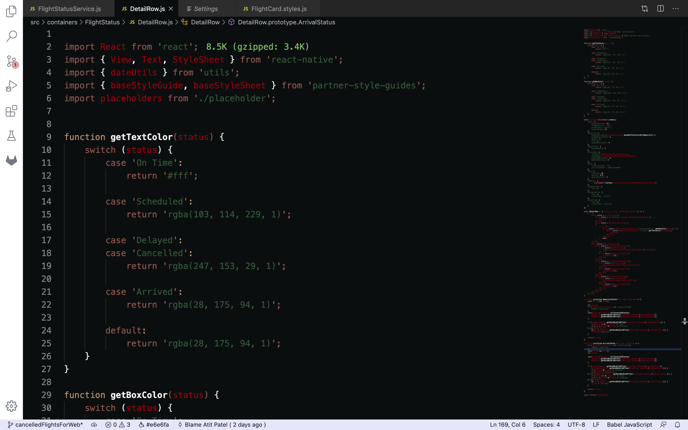
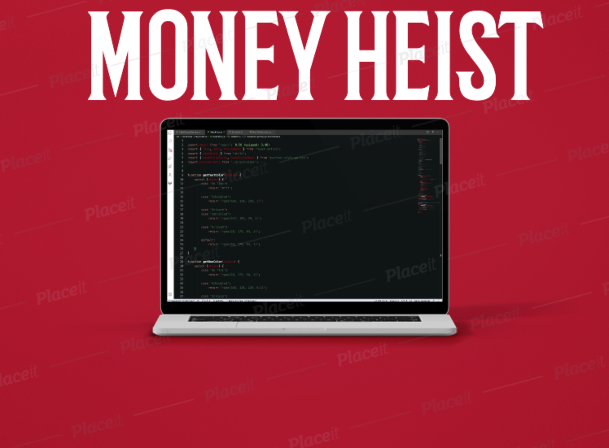

# Theme Samples

This sample color theme extension contains a
color theme on a popular show Money Heist.

## Demo

Money-Heist theme

## Running the sample

- Press `F5` to open a new window with your extension loaded.
- Open `File > Preferences > Color Themes` (or `Code > Preferences > Color Theme` on macOS), and pick `Money Heist`.

## Make changes

- You can relaunch the extension from the debug toolbar after making changes to the files listed above.
- You can also reload (`Ctrl+R` or `Cmd+R` on Mac) the VS Code window with your extension to load your changes.